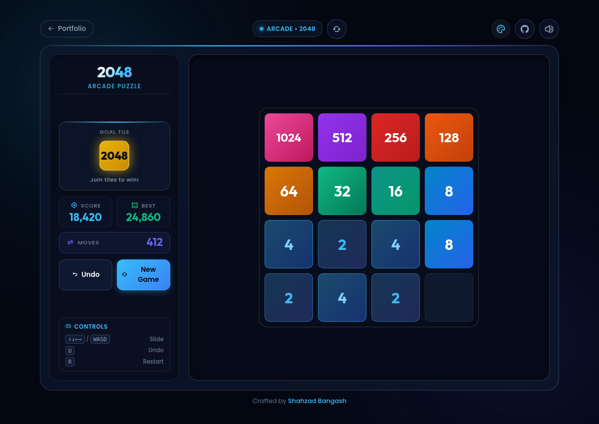
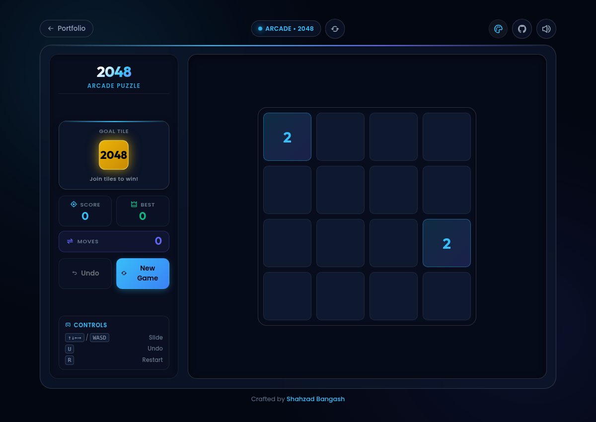
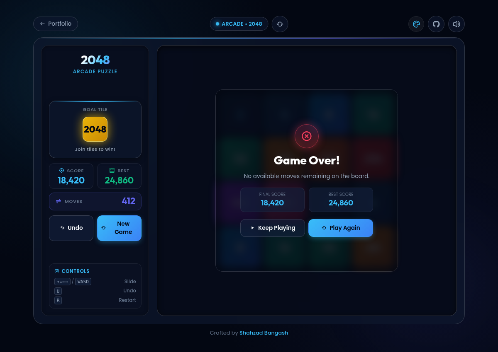

# 🔢 2048 Arcade Game

A sleek, responsive, glassmorphic 2048 puzzle game built with modern Vanilla HTML5, CSS3, and JavaScript. Join adjacent numbered tiles to reach the **2048** tile, track high scores, undo previous moves, and enjoy audio feedback and 5 dynamic themes.

---

### 🌐 [**Play the Game Online &rarr;**](https://shahzad-bangash.github.io/assets/projects/2048/index.html)

---

## 📸 Interface & Gameplay

<div align="center">
  
</div>

<br>

<div align="center">
  <table>
    <thead>
      <tr>
        <th align="center" width="33.3%">🎯 Fresh Start & Sidebar HUD</th>
        <th align="center" width="33.3%">⚡ Interactive Gameplay & Merging</th>
        <th align="center" width="33.3%">🏆 Game Over & Score Summary</th>
      </tr>
    </thead>
    <tbody>
      <tr>
        <td align="center">
          
        </td>
        <td align="center">
          
        </td>
        <td align="center">
          
        </td>
      </tr>
    </tbody>
  </table>
</div>

---

## ✨ Features

- **Classic 2048 Mechanics**: Deterministic tile merging and smooth animations.
- **Dedicated Sidebar HUD**: Real-time score, best score, move counter, and target goal showcase.
- **Move Undo System**: Revert your last move anytime (`U` or `Z` key).
- **Responsive Dual-Column Layout**: Spacious sidebar on Desktop, Laptop, and iPad; adaptive touch layout with on-screen D-Pad on Mobile.
- **Immersive Audio Feedback**: Responsive tile slide, merge pops, and victory/game over sound effects.
- **Touch & Gesture Support**: Swipe in any direction on mobile and tablet devices.

---

## 🚀 Getting Started

1. **Clone the repository:**
   ```bash
   git clone https://github.com/shahzad-bangash/shahzad-bangash.github.io.git
   ```
2. **Navigate to the 2048 directory:**
   ```bash
   cd shahzad-bangash.github.io/assets/projects/2048
   ```
3. **Open `index.html`** in any modern web browser or start a local server:
   ```bash
   python3 -m http.server 8000
   ```
   Navigate to `http://localhost:8000/assets/projects/2048/index.html`.

---

## 🎮 Controls

| Action | Keyboard | Touch / Mobile |
| :--- | :--- | :--- |
| **Slide Up** | `↑` or `W` | Swipe Up / D-Pad Up |
| **Slide Down** | `↓` or `S` | Swipe Down / D-Pad Down |
| **Slide Left** | `←` or `A` | Swipe Left / D-Pad Left |
| **Slide Right** | `→` or `D` | Swipe Right / D-Pad Right |
| **Undo Move** | `U` or `Z` | Tap "Undo" Button |
| **Restart Game** | `R` | Tap "New Game" Button |

---