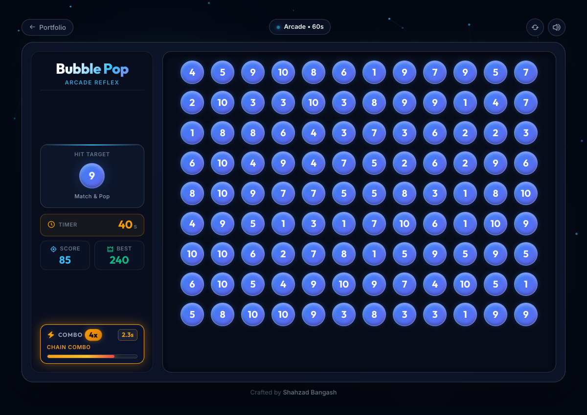
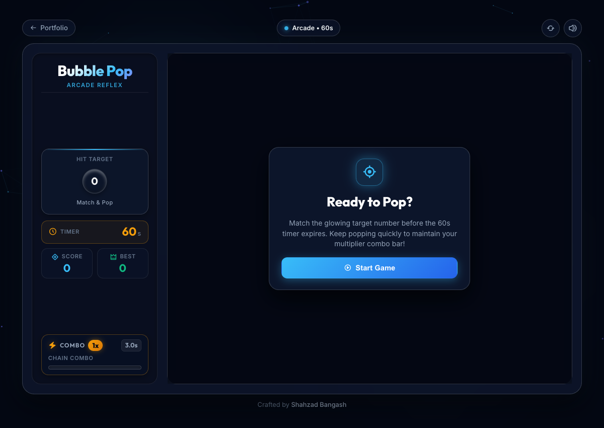
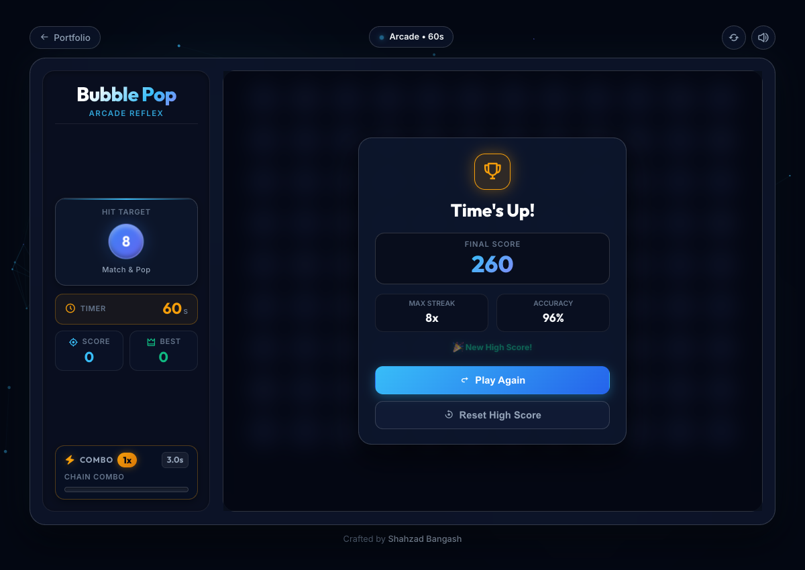

# 🫧 Bubble Pop Arcade

An adrenaline-pumping, fast-paced reflex arcade web game built with Vanilla HTML5, CSS3, and JavaScript. Match glowing target bubbles against the clock, build consecutive streaks to ignite the **dynamic combo multiplier**, and achieve your highest score before the 60-second timer runs out.

---

### 🌐 [**Play the Game Online &rarr;**](https://shahzad-bangash.github.io/assets/projects/bubble_game/index.html)

---

## 📸 Interface & Gameplay

<div align="center">
  
</div>

<br>

<div align="center">
  <table>
    <thead>
      <tr>
        <th align="center" width="33.3%">🎯 Briefing & Start Menu</th>
        <th align="center" width="33.3%">⚡ Live Sidebar & Expanded Grid</th>
        <th align="center" width="33.3%">🏆 Time's Up & Statistics</th>
      </tr>
    </thead>
    <tbody>
      <tr>
        <td align="center">
          
        </td>
        <td align="center">
          
        </td>
        <td align="center">
          
        </td>
      </tr>
    </tbody>
  </table>
</div>

---

## 🎯 How to Play

1. **Check the Target**: Observe the glowing **Hit Target** bubble in the left sidebar.
2. **Pop the Matches**: Tap or click every matching numbered bubble in the playfield before the 60-second timer expires.
3. **Chain Combos**: Pop target bubbles in rapid succession (&lt; 3.0s apart) to build your **Multiplier** (up to 5x+ streak bonus points).
4. **Beat the High Score**: Keep an eye on the urgency warning bar and strive for 100% accuracy.

---

## ✨ Features

- 🎛️ **Left Sidebar Command Center**: Status indicators (Target Bubble, Timer, Score, High Score, and Multiplier gauge) positioned in a dedicated left sidebar, maximizing vertical playfield space for bubbles.
- ⚡ **Dynamic Multiplier Combo Bar**: 3.0-second running-out urgency bar that rewards high-velocity precision.
- 🔊 **Web Audio Synthesizer**: Pitch-scaling pop synth sounds that rise in frequency as your combo builds, downward wrong-hit audio, and victory fanfare.
- 🎨 **Harmonious HSL Palettes**: Cycles through sleek modern color palettes with 3D spherical bubble highlights and ambient glowing orbs.
- 📱 **Responsive Design**: Two-column layout on desktops and laptops with seamless adaptation for mobile screens.
- 💾 **Local Storage High Score**: High score persists automatically across browser sessions.

---

## 🛠️ Built With

- **HTML5**: Semantic layout and accessible playfield structure
- **Vanilla CSS3**: Fluid glassmorphism, responsive CSS grid/flexbox, and micro-animations
- **JavaScript (ES6+)**: Dynamic bubble grid generation, Web Audio API synthesizer, and combo timer engine
- **Boxicons & Google Fonts**: 'Outfit' and 'Inter' typography

---

## 🚀 Getting Started

1. **Clone the repository:**
   ```bash
   git clone https://github.com/shahzad-bangash/shahzad-bangash.github.io.git
   ```
2. **Navigate to the Bubble Game directory:**
   ```bash
   cd shahzad-bangash.github.io/assets/projects/bubble_game
   ```
3. **Open `index.html`** in any modern web browser or start a local server:
   ```bash
   python3 -m http.server 8000
   ```

---

